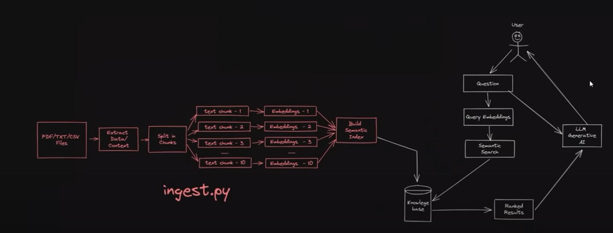

<h1 align="center">ContexualLLM: In Context LLM Chatbot</h1>

<div align="center">

[]()
[](/LICENSE)

</div>

---

<p align="center"> The ContexualLLM allows you to converse with your documents/media files comfortably without the risk of exposing your data.
    <br> 
</p>

## 📝 Table of Contents

- [About](#about)
- [Getting Started](#getting_started)
- [Deployment](#deployment)
- [Usage](#usage)
- [Built Using](#built_using)
- [TODO](../TODO.md)
- [Contributing](../CONTRIBUTING.md)
- [Authors](#authors)
- [Acknowledgments](#acknowledgement)

## 🧐 About <a name = "about"></a>

The ContextualLLM takes in documents of various media types and then you could have a humanlike conversation about the specific content in those documents. You can configure and tune the hyperparameters of the LLM as well. It allows you to keep your files private, without exposing it to the corporate world.

## 🏁 Getting Started <a name = "getting_started"></a>

These instructions will get you a copy of the project up and running on your local machine for development and testing purposes. See [deployment](#deployment) for notes on how to deploy the project on a live system.

### Prerequisites

What things you need to install the software and how to install them.

```
Python
Anaconda
A Strong CPU/GPU
```

### Installing

A step by step series of examples that tell you how to get a development env running.

Firstly clone this repository

```
git clone SabadModi/ContexualLLM
```

Create a seperate virtual environment using Anaconda

```
conda create -n contexualLLM python=3.10.0
conda activate contexualLLM
```

Download all the requirements
```
pip install -r requirements.txt
```

Install Llama-CPP to load models etc.
```
pip install llama-cpp-python
```

After downloading all these requirements, we will launch the UI
Make sure you are in the right directory of the project
```
python streamlit -m UI.py
```

## 🎈 Usage <a name="usage"></a>

1. You can upload the documents required for context
2. Once uploaded, on clicking on the `Generate Embeddings` button will generate the embeddings.
3. You can select the model for embeddings and LLM
4. Tune the hyperparameters
5. Interact with the LLM and enjoy :)



(On changing the embedding model, you would need to delete the `/DB` file manually, and then proceed.)


## 🚀 Deployment <a name = "deployment"></a>

Deployment can be done on Streamlit

## ⛏️ Built Using <a name = "built_using"></a>

- [Langchain](https://www.langchain.com/) - LLM and prompts
- [Chroma](https://www.trychroma.com/) - Vector Database
- [FAISS](https://github.com/facebookresearch/faiss) - Semantic Search
- [Streamlit](https://streamlit.io/) - GUI Interface

## 🖥️ Open Source Usage <a name = "open_source"></a>
- HuggingFace Models
    1. TheBloke/Llama-2-7b-Chat-GGUF
    2. TheBloke/Llama-2-13b-Chat-GGUF
    2. TheBloke/vicuna-13B-v1.5-16K-GGUF

- HuggingFace Embeddings
    1. hkunlp/instructor-large
    2. all-MiniLM-L6-v2
    3. intfloat/e5-base-v2


## 🎉 Acknowledgements <a name = "acknowledgement"></a>

- privateGPT
- h20GPT
